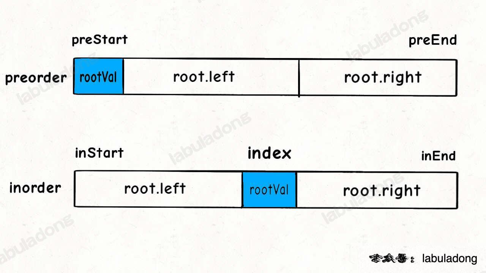
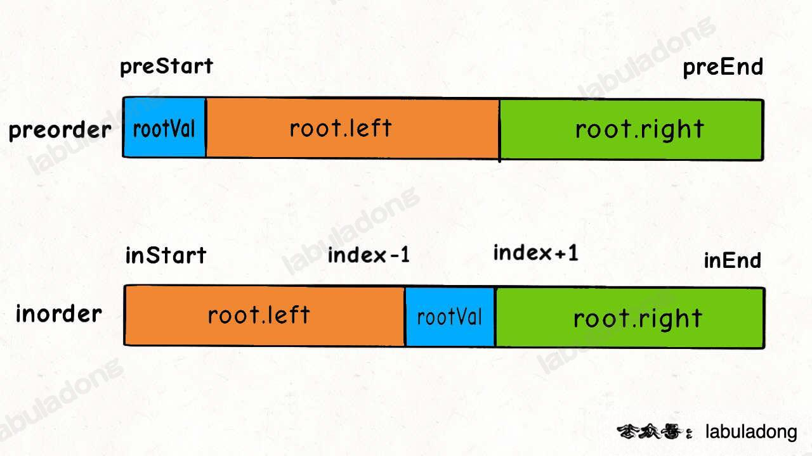

二叉树解题的思维模式分两类：

1. 是否可以通过遍历一遍二叉树得到答案？
   - <font color="red">**用一个traverse函数配合外部变量来实现，**</font>这叫“遍历”的思维模式。
2. 是否可以定义一个递归函数，通过子问题（子树）的答案推导出原问题的答案？
   - <font color="red">**写出这个递归函数的定义，并充分利用这个函数的返回值，**</font>这叫”分解问题“的思维模式。


如果单独抽出一个二叉树节点，它需要做什么事情？需要在什么时候（前/中/后序位置）做？

其他结点不用你操心，递归函数会帮你在所有结点上执行相同的操作。

```java
void traverse(TreeNode root) {
    if (root == null) {
        return;
    }
    // 前序位置
    traverse(root.left);
    // 中序位置
    traverse(root.right);
    // 后序位置
}
```


单链表和数组的遍历可以是迭代的，也可以是递归的，二叉树这种结构无非就是二叉链表，由于没办法改写成迭代形式，所以一般说二叉树的遍历框架都是指递归的形式；

**只要是递归形式的遍历，都可以有前序位置和后序位置，分别在递归之前和递归之后**。

```java
/* 递归遍历单链表，倒序打印链表元素 */
void traverse(ListNode head) {
    if (head == null) {
        return;
    }
    traverse(head.next);
    // 后序位置
    print(head.val);
}
```

本质上是利用**递归的堆栈**帮你**实现倒序遍历**的效果；


**你可以发现每个节点都有“唯一”属于自己的前中后序位置**，所以我说前中后序遍历是遍历二叉树过程中处理每一个节点的三个特殊时间点；

前序位置的代码在刚刚进入一个二叉树节点的时候执行；

后序位置的代码在将要离开一个二叉树节点的时候执行；

**中序位置的代码在一个二叉树节点左子树都遍历完，即将开始遍历右子树的时候执行。**

你可以在前序位置写代码往一个List里塞元素，那最后得到的就是前序遍历的结果；但并不是说你就不可以写更复杂的代码做更复杂的事；


二叉树的所有问题，就是让你在前中后序位置注入巧妙的代码逻辑，去达到自己的目的，你只需要单独思考每一个节点应该做什么，其他的不用你管，抛给二叉树遍历框架，递归会在所有节点上做相同的操作。

> Tips:
>
> 函数命名习惯：二叉树中用遍历思路解题是函数签名一般是void traverse(...)，没有返回值，靠更新外部变量来计算结果，而用分解问题思路解题时函数名根据该函数功能而定，而且一般会有返回值，返回值是子问题的计算结果。


<font color="red">**一颗二叉树的前序遍历结果=根节点+左子树的前序遍历结果+右子树的前序遍历结果。**</font>


前序位置是刚刚进入节点的时刻，后续位置是即将离开节点的时刻；

但这里面大有玄妙，意味着前序位置的代码只能从函数参数中获取父节点传递来的数据，而后序位置的代码不仅可以获取参数数据，还可以获取到子树通过函数返回值传递回来的数据。


一个节点在第几层，你从根节点遍历过来的过程就能顺带记录，用递归函数的参数就能传递下去；

而一个节点为根的整颗子树有多少个节点，你需要遍历完子树之后才能数清楚，然后通过递归函数的返回值拿到答案；

**一旦发现题目和子树有关，那大概率要给函数设置合理的定义和返回值，在后序位置写代码了。**

```java
// 二叉树遍历函数
void traverse(TreeNode root, int level) {
    if (root == null) {
        return;
    }
    // 前序位置
    printf("节点 %s 在第 %d 层", root, level);
    traverse(root.left, level + 1);
    traverse(root.right, level + 1);
}

// 这样调用
traverse(root, 1);
```

```java
// 定义：输入一棵二叉树，返回这棵二叉树的节点总数
int count(TreeNode root) {
    if (root == null) {
        return 0;
    }
    int leftCount = count(root.left);
    int rightCount = count(root.right);
    // 后序位置
    printf("节点 %s 的左子树有 %d 个节点，右子树有 %d 个节点",
            root, leftCount, rightCount);

    return leftCount + rightCount + 1;
}
```


分解问题：一颗二叉树的前序遍历结果=根结点+左子树的前序遍历结果+右子树前序遍历结果；


#### 翻转二叉树

给你一棵二叉树的根节点 `root` ，翻转这棵二叉树，并返回其根节点。

**示例 1：**


> 输入：root = [4,2,7,1,3,6,9]
>
> 输出：[4,7,2,9,6,3,1]

**示例 2：**


> 输入：root = [2,1,3]
>
> 输出：[2,3,1]

##### 1 这题能不能用“遍历”的思维模式解决？

可以，我写一个`traverse`函数遍历每个节点，让每个节点的左右子节点颠倒过来就行；

**单独抽出一个节点，需要让它做什么？**让它把自己的左右子节点交换一下。

**需要在什么时候做？**好像前中后序位置都可以。

综上，可以写出如下解法代码：

```java
public TreeNode invertTree(TreeNode root) {
  // 遍历二叉树，交换每个节点的子节点
  traversal(root);
  return root;
}

// 二叉树遍历函数
void traversal(TreeNode root) {
  if (root == null) {
    return;
  }
  
  // 前序位置
  // 每一个节点需要做的事就是交换它的左右子节点
  TreeNode temp = root.left;
  root.left = root.right;
  root.right = temp;
  
  // 遍历框架，去遍历左右子树的节点
  traversal(root.left);
  traversal(root.right);
}
```

##### 2 这题能不能用“分解问题”的思维模式解决？

**我们尝试`invertTree`函数赋予一个定义：**

```java
// 定义：将以 root 为根的这棵二叉树翻转，返回翻转后的二叉树的根节点
TreeNode invertTree(TreeNode root);
```

**然后思考，对于某一个二叉树`x`执行`invertTree(x)`，你能利用这个递归函数的定义做点啥？**

你可以用`invertTree(root.left)`先把`x`的左子树翻转，再用`invertTree(root.right)`把`x`的右子树翻转，最后把`x`的右子树翻转，最后把`x`为根的整颗二叉树的翻转，即完成拉`invertTree(x)`的定义。

```java
// 定义：将以 root 为根的这棵二叉树翻转，返回翻转后的二叉树的根节点
TreeNode invertTree(TreeNode root) {
    if (root == null) {
        return null;
    }
    // 利用函数定义，先翻转左右子树
    TreeNode left = invertTree(root.left);
    TreeNode right = invertTree(root.right);

    // 然后交换左右子节点
    root.left = right;
    root.right = left;

    // 和定义逻辑自恰：以 root 为根的这棵二叉树已经被翻转，返回 root
    return root;
}
```

“分解问题”的思路，核心在于你要给递归函数一个合适的定义，然后用函数的定义来解释你的代码；


#### 填充节点的右侧指针

给定一个 **完美二叉树** ，其所有叶子节点都在同一层，每个父节点都有两个子节点。二叉树定义如下：

```c++
struct Node {
  int val;
  Node *left;
  Node *right;
  Node *next;
}
```

填充它的每个 next 指针，让这个指针指向其下一个右侧节点。如果找不到下一个右侧节点，则将 next 指针设置为 `NULL`。

初始状态下，所有 next 指针都被设置为 `NULL`。

**示例 1：**


> 输入：root = [1,2,3,4,5,6,7]
>
> 输出：[1,#,2,3,#,4,5,6,7,#]
>
> 解释：给定二叉树如图 A 所示，你的函数应该填充它的每个 next 指针，以指向其下一个右侧节点，如图 B
>
> 所示。序列化的输出按层序遍历排列，同一层节点由 next 指针连接，'#' 标志着每一层的结束。

##### 1 这题能不能用“遍历”的思维模式解决？

每个节点要做的事也很简单，把自己的`next`指针指向右侧节点就行了。

```java
// 二叉树遍历函数
void traverse(Node root) {
    if (root == null || root.left == null) {
        return;
    }
    // 把左子节点的 next 指针指向右子节点
    root.left.next = root.right;

    traverse(root.left);
    traverse(root.right);
}
```

但是，这段代码其实有很大问题，因为它只能把相同父节点的两个节点穿起来：


结点5和结点6不属于同一个父节点，那么按照这段代码的逻辑，它俩就没办法被穿起来；

**传统的 `traverse` 函数是遍历二叉树的所有节点，但现在我们想遍历的其实是两个相邻节点之间的“空隙”。**

所以我们可以在二叉树的基础上进行抽象，你把图中的每一个方框看做一个节点：

这样，一颗二叉树被抽象成了一颗三叉树，三叉树上的每个节点就是原先二叉树的两个相邻节点；

现在，我们只要实现一个 `traverse` 函数来遍历这颗三叉树，每个“三叉树节点“需要做的事就是把自己内部的两个二叉树节点穿起来：

```java
public Node connect(Node root) {
  if (root == null) {
    return null;
  }
  traverse(root.left, root.right);
  return root;
}

void traverse(Node left, Node right) {
  if (left == null && right == null) {
    return;
  }
  // 连接相同父结点的两个子节点
  left.next = right;
  // 连接left子结点
  traverse(left.left, left.right);
  traverse(right.left, right.right);
  // 连接不同父节点相邻子结点
  traverse(left.right, right.left);
}
```


#### 二叉树展开为链表

给你二叉树的根结点 `root` ，请你将它展开为一个单链表：

- 展开后的单链表应该同样使用 `TreeNode` ，其中 `right` 子指针指向链表中下一个结点，而左子指针始终为 `null` 。
- 展开后的单链表应该与二叉树 [**先序遍历**](https://baike.baidu.com/item/先序遍历/6442839?fr=aladdin) 顺序相同。

**示例 1：**


> 输入：root = [1,2,5,3,4,null,6]
> 输出：[1,null,2,null,3,null,4,null,5,null,6]

**示例 2：**

> 输入：root = []
> 输出：[]

**示例 3：**

> 输入：root = [0]
> 输出：[0]


##### 遍历的思路

当然可以，借助一个 `虚拟头节点pummy` 和  `操作链表的指针p` 的外部变量，在 `traverse` 的前序位置将每个节点接到虚拟头节点后面；

但是题目定义的函数返回值为void，说明要在返回root节点本身；


##### 分解问题的思路

明确函数定义：输入节点root，然后root为根的二叉树就会被拉平为一条链表。

```java
void flatten(TreeNode root);
```

有了这个函数定义，如何按照题目要求把一颗树拉平成一条链表？

对于一个节点x，可以执行以下流程：

1、先利用flatten(x.left)和flatten(x.right)将x的左右子树拉平；

2、将x的右子树接到左子树下方，然后将整个左子树作为右子树；


这样，以x为根的整颗二叉树就被拉平了，恰好完成了flatten(x)的定义；

```java
// 将以root的为根的树拉平成链表
// 思路：利用函数定义，将左右子树拉平，在将左子树变为右子树，右子树接到左子树后面
public void flatten(TreeNode root) {
  if (root == null) {
    return;
  }
  flatten(root.left);
  flatten(root.right);

  // 后序位置，将左子树变为右子树，并将右子树接到后面
  TreeNode left = root.left;
  TreeNode right = root.right;
  // 将左子树变成右子树
  root.left = null;
  root.right = left;
  TreeNode p = root;
  while (p.right != null) {
    p = p.right;
  }
  p.right = right;
}
```


### 构造二叉树

**二叉树的构造问题一般都是使用<font color="red">“分解问题”</font>的思路：构造整颗树=根节点+构造左子树+构造右子树。**

#### 最大二叉树

给定一个不重复的整数数组 `nums` 。 **最大二叉树** 可以用下面的算法从 `nums` 递归地构建:

1. 创建一个根节点，其值为 `nums` 中的最大值。
2. 递归地在最大值 **左边** 的 **子数组前缀上** 构建左子树。
3. 递归地在最大值 **右边** 的 **子数组后缀上** 构建右子树。

返回 `nums` 构建的**最大二叉树** 。

**示例 1：**


> 输入：nums = [3,2,1,6,0,5]
> 输出：[6,3,5,null,2,0,null,null,1]
> 解释：递归调用如下所示：
>
> - [3,2,1,6,0,5] 中的最大值是 6 ，左边部分是 [3,2,1] ，右边部分是 [0,5] 。
>     - [3,2,1] 中的最大值是 3 ，左边部分是 [] ，右边部分是 [2,1] 。
>         - 空数组，无子节点。
>         - [2,1] 中的最大值是 2 ，左边部分是 [] ，右边部分是 [1] 。
>             - 空数组，无子节点。
>             - 只有一个元素，所以子节点是一个值为 1 的节点。
>     - [0,5] 中的最大值是 5 ，左边部分是 [0] ，右边部分是 [] 。
>         - 只有一个元素，所以子节点是一个值为 0 的节点。
>         - 空数组，无子节点。

**示例 2：**


> 输入：nums = [3,2,1]
> 输出：[3,null,2,null,1]

#####思路：

每个二叉树节点都可以认为是一颗树的根节点，对于根节点，首先要做的当然是想办法把自己先构造出来，然后想办法构造自己的左右子树。

所以，我们要便利数组找到最大值maxVal，从而把根节点 `root` 做出来，然后对maxVal左边的数组和右边的数组进行递归构建，作为root的左右子树；

**当前 `nums` 中的最大值就是根节点，然后根据索引递归调用左右数组构造左右子树即可**

明确了思路，我们重新写一个辅助函数 `build` ，来控制 `nums` 的索引：

```java
/* 主函数 */
TreeNode constructMaximumBinaryTree(int[] nums) {
    return build(nums, 0, nums.length - 1);
}

// 定义：将nums[lo,hi]构造成符合条件的树，返回其根节点
TreeNode build(int[] nums, int lo, int hi) {
    // base case
    if (hi < lo) {
        return null;
    }
    // 找到nums[lo,hi]中最大值，及其下标
    int index = -1, maxVal = Integer.MIN_VALUE;
    for (int i = lo; i <= hi; i++) {
        if (nums[i] > maxVal) {
            maxVal = nums[i];
            index = i;
        }
    }

    TreeNode root = new TreeNode(maxVal);
    root.left = build(nums, lo, index-1);
    root.right = build(nums, index+1, hi);
    return root;
}
```

#### 通过前序和中序遍历结果构造二叉树

给定两个整数数组 `preorder` 和 `inorder` ，其中 `preorder` 是二叉树的**先序遍历**， `inorder` 是同一棵树的**中序遍历**，请构造二叉树并返回其根节点。

 

**示例 1:**


> 输入: preorder = [3,9,20,15,7], inorder = [9,3,15,20,7]
> 输出: [3,9,20,null,null,15,7]

**示例 2:**

> 输入: preorder = [-1], inorder = [-1]
> 输出: [-1]

直接来想思路，首先思考，根节点应该做什么。

<font color="red">**类似上一题，我们肯定要想办法确定根节点的值，把根节点做出来，然后递归构造左右子树即可。**</font>

```java
void traverse(TreeNode root) {
    // 前序遍历
    preorder.add(root.val);
    traverse(root.left);
    traverse(root.right);
}

void traverse(TreeNode root) {
    traverse(root.left);
    // 中序遍历
    inorder.add(root.val);
    traverse(root.right);
}
```


找到跟节点是很简单的，前序遍历的第一个值 `preorder[0]` 就是跟节点的值。

关键在于如何通过根节点的值，将 `preorder` 和 `inorder` 数组划分成两半，构造跟节点的左右子树？






前序位置的代码只能从函数参数中获取父节点传递来的数据，而后序位置的代码不仅可以获取参数数据，还可以获取到子树通过函数返回值传递回来的数据。


**那么换句话说，一旦你发现题目和子树有关，那大概率要给函数设置合理的定义和返回值，在后序位置写代码了。**


#### 寻找重复的子树

给你一棵二叉树的根节点 `root` ，返回所有 **重复的子树** 。

对于同一类的重复子树，你只需要返回其中任意 **一棵** 的根结点即可。

如果两棵树具有 **相同的结构** 和 **相同的结点值** ，则认为二者是 **重复** 的。

**示例 1：**


```java
输入：root = [1,2,3,4,null,2,4,null,null,4]
输出：[[2,4],[4]]
```

**示例 2：**


```java
输入：root = [2,1,1]
输出：[[1]]
```

**示例 3：**

****

```java
输入：root = [2,2,2,3,null,3,null]
输出：[[2,3],[3]]
```


函数签名

```java
List<TreeNode> findDuplicateSubtrees(TreeNode root);
```


**首先来思考，我如何才能知道以自己为根的这颗二叉树长啥样？**

我要知道以自己为根的子树长啥样，是不是得先知道我的左右子树长啥样，再加上自己，就构成了整颗子树的样子？左右子树的样子，可不就得在后序位置通过递归函数的返回值传递回来么？


如果你还绕不过来，再来举个非常简单的例子：计算一颗二叉树有多少个节点。

```java
int count(TreeNode root) {
    if (root == null) {
        return 0;
    }
    // 先算出左右子树有多少节点
    int left = count(root.left);
    int right = count(root.right);
    // 后序位置，子树加上自己，就是整棵二叉树的节点数
    int res = left + right + 1;
    return res;
}
```


现在，明确了要用后序遍历，那应该怎么描述一颗二叉树的模样呢？

就以二后序遍历结果作为序列化结果，可以通过拼接字符串的方式把二叉树序列化；

```java
// 定义：输入以 root 为根的二叉树，返回这棵树的序列化字符串
String serialize(TreeNode root) {
    // 对于空节点，可以用一个特殊字符表示
    if (root == null) {
        return "#";
    }
    // 将左右子树序列化成字符串
    String left = serialize(root.left);
    String right = serialize(root.right);
    /* 后序遍历代码位置 */
    // 左右子树加上自己，就是以自己为根的二叉树序列化结果
    String myself = left + "," + right + "," + root.val;
    return myself;
}
```


